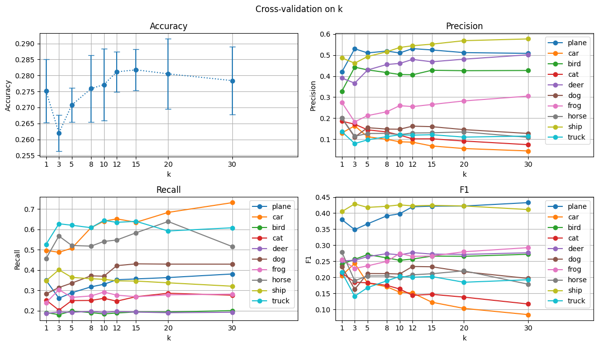
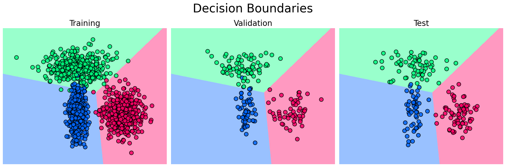
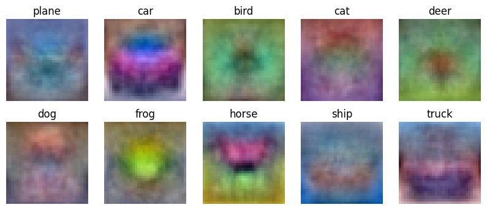
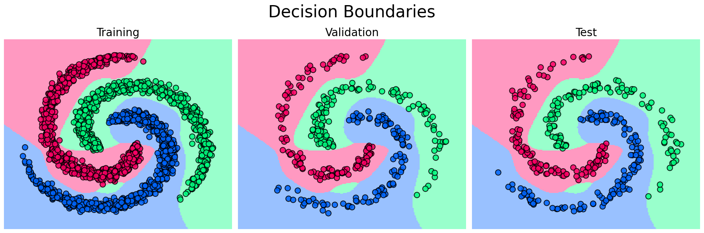
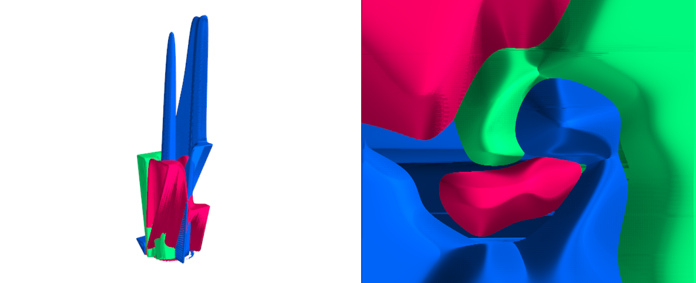
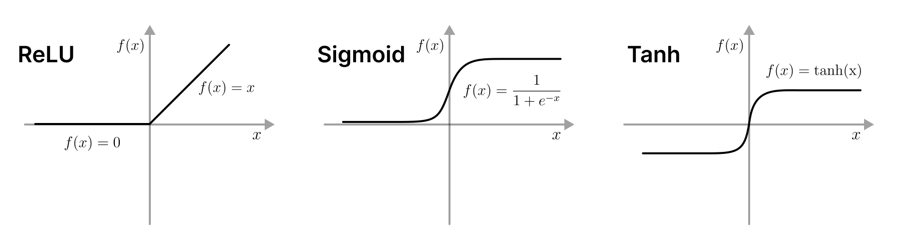
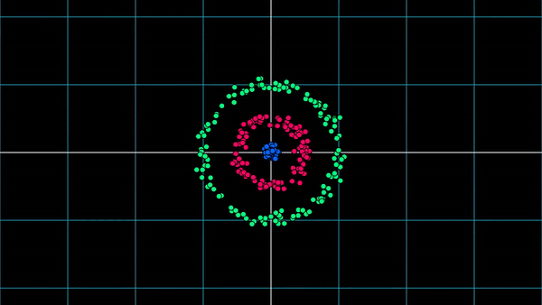

# HW 2 - Classification

This is official repository for the second homework assignment of the
course [UROB](https://intranet.fel.cvut.cz/cz/education/bk/predmety/66/51/p6651806.html). The assignment is about
classification - its understanding and implementation.

## Sections

- [What will you learn?](#what-will-you-learn)
- [Getting started](#getting-started)
- [Working on the assignments](#working-on-the-assignments)
- [How to submit](#how-to-submit)

## What will you learn?

In this homework, you will start by reviewing the basics of classification, and
then you will implement a simple classifier. Then you will learn about more advanced classifiers using deep learning.
After this homework, you will have a broad understanding of classification, and you will understand these terms:

- ### Cross-Validation: A Vital Model Assessment Technique

Cross-validation emerges as a crucial technique for evaluating machine learning models. It operates by training multiple
ML models on subsets of the available input data and subsequently evaluating their performance on the complementary
subsets. While this method can be computationally demanding, it yields substantial benefits. By employing
cross-validation, you can maximize your utilization of the available data for model assessment, a particularly
advantageous approach when working with limited data resources.

<div align="center">
    
    <hr>
</div>

- ### Linear Classifier: The Fundamental Building Block

Linear classifiers constitute a foundational category of algorithms within the machine learning landscape. These
algorithms play a pivotal role in assigning input values to discrete categories. While they represent one of the
simplest classification algorithms in the field, they serve as the cornerstone for numerous other advanced
classification techniques.

You will explore the linear classifier from two distinct angles:

<div align="center">
    <h4>Geometric Perspective</h4>
    
    
    <br>
    <br>
    <h4>Template Matching Perspective</h4>
    
    <hr>
</div>

- ### Neural Network Classifier: Unveiling Complexity

Among the most intricate classifiers you will tackle is the neural network classifier. This journey will demystify
neural networks and unveil the inner workings behind their decision-making processes.

<div align="center">
    <h4>Complex Decision Boundaries of Neural Networks</h4>
    
    
</div>

During your exploration, you will experiment with various activation functions and observe their effects on decision
boundaries.

<div align="center">
    <h4>Activation Functions</h4>
    
</div>

Furthermore, you will witness how neural networks learn features by transforming input data into a novel space. This
journey also highlights the connections between neural networks and linear classifiers.

<div align="center">
    <h4>Feature Space Transformation</h4>
    
</div>

By delving into these facets, you will gain profound insights into the intricacies of neural network classifiers,
enhancing your comprehension of this powerful machine learning tool.

## Getting started

To begin your journey with this assignment, follow these simple steps:

1. **Clone the Repository**: Start by cloning this repository to your local computer. Use the following command in your
   terminal:

    ```shell
    git clone https://github.com/urob-ctu/hw2.git
    ```

2. **Install Dependencies**: We recommend using a conda environment to manage dependencies. Create the environment by
   executing:

    ```shell
    conda env create --name hw2 --file environment.yaml
    ```

   After the environment is created, activate it with:

    ```shell
    conda activate hw2
    ```

   If you are using a different environment manager, please refer to the documentation for the appropriate
   commands and make sure you have Python 3.10 installed.

3. **Choose Your IDE**: Next, open the project in your preferred Integrated Development Environment (IDE). While we
   suggest PyCharm, the choice ultimately lies with you.

   > **Warning**
   > If you are using PyCharm, you need to disable the *invert image outputs for dark themes* if you are using one. You
   can
   > do it by going to Preferences | Languages & Frameworks | Jupyter | Invert image outputs for dark themes. For users
   of alternative Integrated Development Environments (IDEs), please locate the analogous setting. Failing to make this
   adjustment could result in images that might not look as visually appealing as intended. :)
   
## Working on the Assignments

The homework is divided into several sections, each residing in its own notebook. You can locate these notebooks in
the project's root directory. To make steady progress, adhere to the following sequence:

1. [Introduction to k-Nearest Neighbors](knn_part_1.ipynb)
2. [k-Nearest Neighbors: Hyperparameter Optimization](knn_part_2.ipynb)
3. [Introduction to Linear Classifiers](linear_part_1.ipynb)
4. [Linear Classifier as a Template Matching Algorithm](linear_part_2.ipynb)
5. [Introduction to Neural Networks](mlp_part_1.ipynb)
6. [Training the Multilayer Perceptron](mlp_part_2.ipynb)

Inside each notebook, you will find task descriptions and the specific files you need to modify. These editable files
are situated in the `assignments` directory. Please refrain from altering any other files. Within these designated
files, make changes only to sections resembling the following:

```python
# ▰▱▰▱▰▱▰▱▰▱▰▱▰▱▰▱▰▱▰▱▰▱▰▱ Assignment 1.1 ▰▱▰▱▰▱▰▱▰▱▰▱▰▱▰▱▰▱▰▱▰▱▰▱▰ #
# TODO:                                                             #
# Calculate the L2 distance between the ith test point and the jth  #
# training point and store the result in dists[i, j]. Avoid using   #
# loops over dimensions or np.linalg.norm().                        #
# ▰▱▰▱▰▱▰▱▰▱▰▱▰▱▰▱▰▱▰▱▰▱▰▱▰▱▰▱▰▱▰▱▰▱▰▱▰▱▰▱▰▱▰▱▰▱▰▱▰▱▰▱▰▱▰▱▰▱▰▱▰▱▰▱▰ #
# 🌀 INCEPTION 🌀 (Your code begins its journey here. 🚀 Do not delete this line.)
#
#                    ╔═══════════════════════╗
#                    ║                       ║
#                    ║       YOUR CODE       ║
#                    ║                       ║
#                    ╚═══════════════════════╝
#
# 🌀 TERMINATION 🌀 (Your code reaches its end. 🏁 Do not delete this line.)
```

Remember, any modifications outside of this designated section can cause the autograder to fail, resulting in a
suboptimal grade. If you have any questions, please reach out to the teaching assistants.

To test your code, you can run the following command in your terminal:

```shell
python test_assignments.py
```

## How to submit

Once you've completed the assignment and are ready to submit your work, use the following command in your terminal:

```shell
python submit.py
```

This will create a zip file named `hw2.zip` in the project's root directory. Submit this file to
the [BRUTE](https://cw.felk.cvut.cz/brute/student/) system.